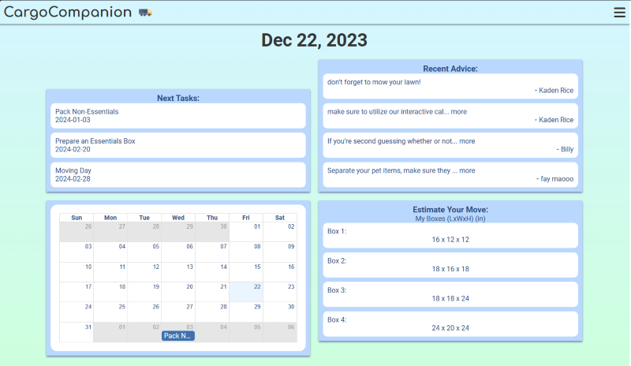
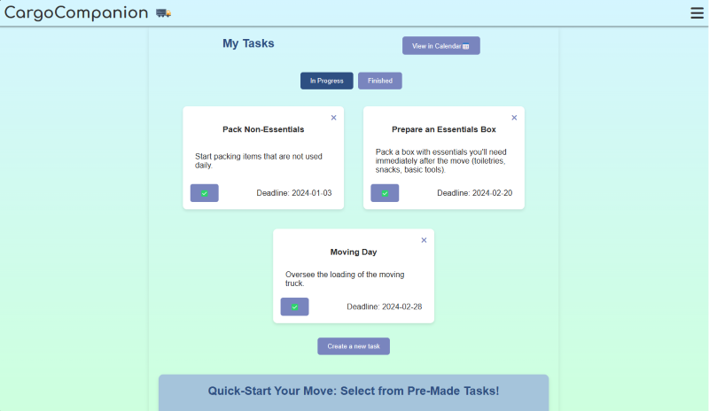
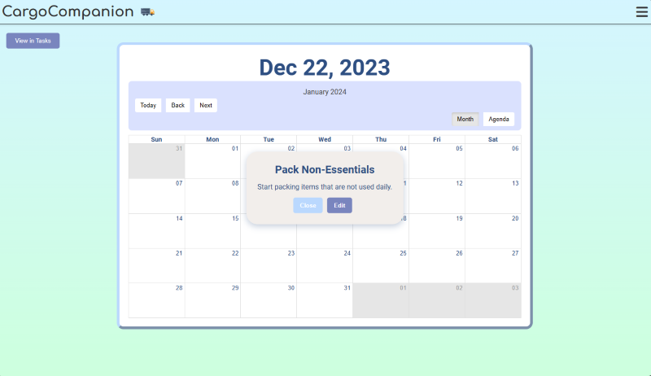
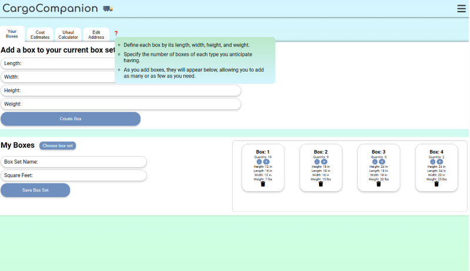
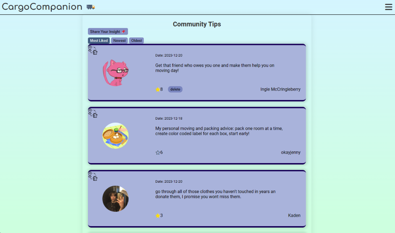

# CargoCompanion

## Overview

CargoCompanion is a feature-rich web application designed to streamline the moving process. Built with React, TypeScript, and CSS, and powered by Vite for rapid development, it integrates Firebase for authentication and data management. This application is an essential tool for users planning a move, offering functionalities like task management, calendar scheduling, cost estimation, and community engagement.

## Key Features

- **Firebase Authentication**: Secure user authentication and account management.
- **Dynamic Dashboard**: Overview of upcoming tasks, mini-calendar view, and access to community tips.

  

- **Task Management**: Add, view, and manage moving-related tasks with deadlines.

  

- **Interactive Calendar**: Large, interactive calendar for tracking tasks and events.

  

- **Cost Estimate**: Real-time shipping cost estimation using the Shippo API, considering various parcel dimensions.

  

- **U-Haul Cost Estimation**: Calculate the cost and feasibility of moving items in a U-Haul, including space and mileage considerations.
- **Community Tips**: A platform for users to exchange advice and experiences about moving.

  

- **Engaging Landing Page**: Featuring an eye-catching animation that introduces users to CargoCompanion.


## Installation

1. Clone the repository:

   ```bash
   git clone https://github.com/kadenisrice/move-helper-frontend.git
   ```

2. Navigate to the project directory:

   ```bash
   cd CargoCompanion
   ```

3. Install dependencies:

   ```bash
   npm install
   ```

4. Start the application:

   ```bash
   npm run dev
   ```

   The application will be available at [http://localhost:5173/](http://localhost:5173/).

## Usage

### Getting Started

1. **Sign Up/Log In**: Use Firebase authentication to create an account or log in.
2. **Set Addresses**: Input your 'from' and 'to' moving addresses.
3. **Navigate the Dashboard**: Access your tasks, view the calendar, and read community tips.

### Advanced Features

- **Add Tasks**: Plan your moving process by adding detailed tasks.
- **Cost Estimates**: Utilize real-time data to estimate shipping costs for your parcels and plan U-Haul rentals.
- **Interactive Calendar**: Use the calendar for scheduling and getting a visual overview of your moving plan.

## Contributing

Contributions to CargoCompanion are welcome. Please follow these guidelines:

1. Fork the project.
2. Create a feature branch (`git checkout -b feature/AmazingFeature`).
3. Commit your changes (`git commit -m 'Add some AmazingFeature'`).
4. Push to the branch (`git push origin feature/AmazingFeature`).
5. Open a pull request.

---
